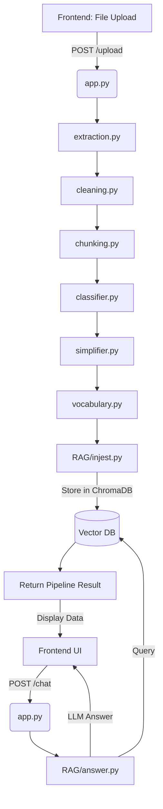

# ⚖️ JanNyaya Backend API Documentation

This document provides a comprehensive guide for frontend developers to integrate with the JanNyaya Legal AI backend.

---

## 🧠 1. System Overview

JanNyaya follows a sophisticated linear pipeline to process legal documents into simplified, queryable data.

1.  **Upload & Extraction**: User uploads a file (PDF, Image, DOCX, TXT). OCR is used for scanned documents.
2.  **Cleaning**: Legal text is normalized (Unicode fix, whitespace cleanup, removal of page artifacts).
3.  **Chunking**: The text is split into logical sections (Facts, Reasoning, etc.) and token-limited segments.
4.  **Classification**: Each chunk is classified by an LLM (e.g., *Judgment*, *Evidence*) to provide structural context.
5.  **Simplification**:
    *   **Phase 1**: Individual chunks are rewritten into plain English.
    *   **Phase 2**: Simplified chunks are merged into a final "Master Summary."
6.  **Vocabulary Extraction**: Legal terms are identified and simplified for a layperson.
7.  **RAG Ingestion**: Chunks are embedded and stored in a vector database (ChromaDB) for context-aware chatting.
8.  **Translation**: The final output or chat responses can be translated into major Indian languages.

---

## 🔌 2. API Documentation

### 📤 Upload & Process
Processes a legal document through the entire pipeline.

*   **URL**: `/upload`
*   **Method**: `POST`
*   **Content-Type**: `multipart/form-data`
*   **Request Body**:
    *   `file`: The document file (Supported: `.pdf`, `.docx`, `.png`, `.jpg`, `.jpeg`, `.webp`, `.txt`)
*   **Success Response**:
    *   **Code**: 200 OK
    *   **Format**: `JSON`

#### Example JSON Response
```json
{
  "raw_text": "THE GAUHATI HIGH COURT...",
  "cleaned_text": "The Gauhati High Court...",
  "chunks": [
    {
      "text": "Facts of the case include...",
      "label": "Facts",
      "confidence": 1.0
    }
  ],
  "chunks_count": 1,
  "final_output": "## Document Type: Court Order\n## Overview: ...",
  "vocab": {
    "terms": [
      {
        "term": "Interlocutory Application",
        "meaning": "A request made to a court for a temporary order while a main case is still pending."
      }
    ]
  }
}
```

---

### 💬 Legal Assistant Chat (RAG)
Allows users to ask questions about the uploaded document.

*   **URL**: `/chat`
*   **Method**: `POST`
*   **Request Body**:
```json
{
  "question": "What is the final decision of the court?"
}
```
*   **Success Response**:
```json
{
  "answer": "The court dismissed the application for amendment..."
}
```

---

### 🌐 Translation
Translates selected text into a target language.

*   **URL**: `/translate`
*   **Method**: `POST`
*   **Request Body**:
```json
{
  "text": "The court dismissed the case.",
  "language": "Hindi"
}
```
*   **Supported Languages**: `Hindi`, `Tamil`, `Telugu`, `Kannada`, `Malayalam`
*   **Success Response**:
```json
{
  "translated_text": "अदालत ने मामला खारिज कर दिया।"
}
```

---

### 🧹 Session Cleanup
Deletes the temporary vector collection for the current session.

*   **URL**: `/cleanup`
*   **Method**: `POST`
*   **Success Response**:
```json
{
  "status": "deleted"
}
```

---

## 📦 3. Data Structures

### `chunks[]`
An array of objects representing the segmented document.
- `text`: The actual content of the chunk.
- `label`: Category (e.g., *Case Details*, *Parties*, *Facts*, *Arguments*, *Evidence*, *Legal Issues*, *Court Reasoning*, *Judgment*, *General*).
- `confidence`: Confidence score of the classifier (0.0 to 1.0).

### `vocab.terms[]`
An array of legal terms identified in the document.
- `term`: The complex legal word/phrase.
- `meaning`: A simple, one-sentence explanation.

### `final_output`
A Markdown-formatted string containing the structured simplification.
- Includes `## Document Type`, `## Overview`, `## Main Content`, `## Key Takeaways`, and `## Flags`.

---

## 🔄 4. Data Flow Diagram



---

## 🎯 5. Frontend Integration Guide

1.  **Standard Flow**:
    *   Call `/upload` first. This is a heavy call; show a multi-step loader (Extracting... Cleaning... Simplifying...).
    *   Store the `final_output` for display.
    *   Store `vocab.terms` for tooltips or a "Legal Glossary" side-panel.
    *   Store `chunks` for an "In-Depth View" where users can see specific classified parts.
2.  **Chaining**:
    *   Call `/translate` only when the user selects a language from a dropdown.
    *   Call `/chat` only after a successful `/upload`.
    *   Call `/cleanup` when the user closes the tab or starts a new session.

---

## 🎨 6. UI/UX Recommendations

- **Vocabulary Tooltips**: Parse the document text in the UI and highlight words found in `vocab.terms`. Show the `meaning` on hover.
- **Labelled Chunks**: Use color-coded badges for chunk labels (e.g., Red for *Judgment*, Blue for *Facts*).
- **Summary Panel**: Render the `final_output` markdown using a library like `react-markdown`.
- **Chat Interface**: Use a conversational UI with bubbles. Show a "Thinking..." state while waiting for the LLM.

---

## ⚠️ 7. Error Handling

- **Upload Failures**: Handle `413 Payload Too Large` or `500` errors if OCR fails.
- **Empty Vocab**: If `vocab.terms` is empty, hide the glossary section.
- **Chat Context**: If the LLM returns "Not found in document," clarify to the user that the query is outside the scope of the file.

---

## ⏳ 8. Loading & State Management

- **Progressive Loading**: Since `/upload` takes time (~10-30s for large files), consider adding "heartbeat" animations or specific pipeline step markers if possible.
- **Async Chat**: Chat responses should block the input field until a response is received to prevent race conditions in `CHAT_HISTORY`.

---

## 🚀 9. Scalability Notes

- **Large Documents**: The backend chunks documents into 1200-token segments. Frontend should be prepared to render long lists of chunks.
- **Ollama Latency**: If self-hosting Ollama, expect higher latency for the `final_output` generation.
